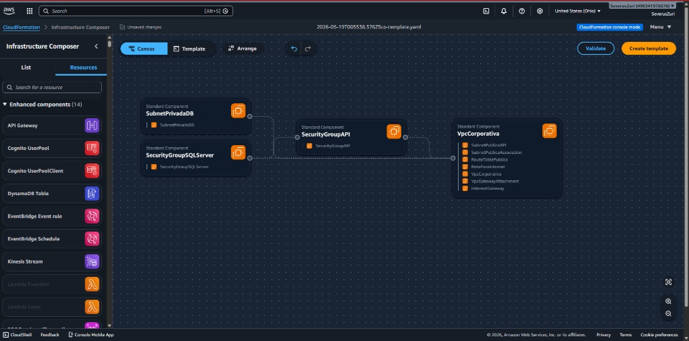
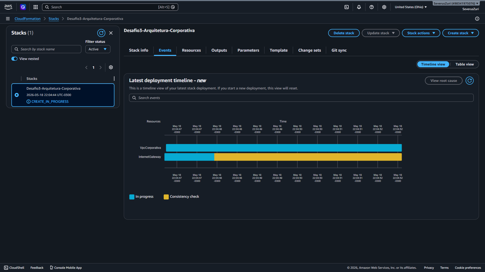
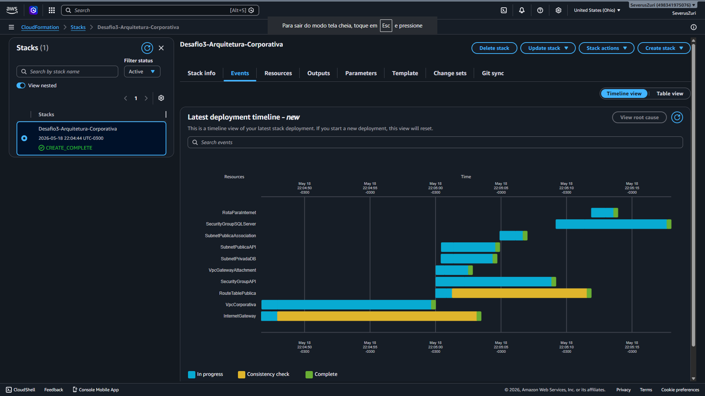

# Infraestrutura como Código (IaC) para Arquiteturas Multicamadas na AWS 🚀

Este diretório contém os artefatos de engenharia de infraestrutura desenvolvidos para o **Desafio 3** do Bootcamp de Cloud AWS da GFT/DIO. O projeto implementa um ambiente de rede corporativo completo, isolado e altamente seguro usando **AWS CloudFormation** para provisionar uma topologia multicamadas (*Multi-Tier Architecture*).

---

## 🗺️ Visão Geral da Topologia de Rede Declarada

O modelo declarativo gerencia e automatiza o provisionamento das seguintes camadas perimetrais de infraestrutura:

1.  **VPC Corporativa (`10.0.0.0/16`):** Rede lógica totalmente isolada e dedicada à execução dos serviços corporativos.
2.  **Camada Web Pública (Subnet `10.0.1.0/24`):** Sub-rede pública acoplada a um *Internet Gateway*, configurada para hospedar instâncias computacionais (Amazon EC2) responsáveis pelas Web APIs construídas em **.NET Core**.
3.  **Camada de Dados Privada (Subnet `10.0.2.0/24`):** Sub-rede isolada, sem rota direta para a internet, projetada para abrigar instâncias de bancos de dados relacionais (**Amazon RDS para SQL Server**).

---

## 🔐 Políticas de Segurança e Controle Perimetral (Firewall)

A arquitetura do template implementa regras estritas seguindo o princípio do menor privilégio do *AWS Well-Architected Framework*:

* **Security Group da API (`SG-WebAPI-NET`):** Funciona como um firewall de borda, permitindo tráfego público de entrada (`0.0.0.0/0`) estritamente nas portas de produção web `80` (HTTP) e `443` (HTTPS).
* **Security Group do Banco de Dados (`SG-Database-SQLServer`):** Bloqueia qualquer tentativa de conexão externa global. A regra de *Ingress* permite tráfego na porta padrão do Microsoft SQL Server (`1433`) **única e exclusivamente** se a origem da requisição partir do ID lógico gerado pelo Security Group da camada de API.

---

## 📊 Ciclo de Evidências e Provisionamento da Stack IaC

O processo de deploy da infraestrutura declarativa foi validado e monitorado ponta a ponta no console da AWS através das seguintes etapas:

### 1. Modelagem Arquitetural (Canvas)
Mapeamento lógico e diagramação automatizada das interconexões e dependências entre a VPC, as subnets e os firewalls perimetrais, gerado através do *AWS Infrastructure Composer*:

### 2. Inicialização do Orquestrador
Upload do template declarativo validado e inicialização do pipeline de criação de recursos em cascata:

### 3. Convergência e Sucesso do Deploy
Linha do tempo consolidada com o status estável **`CREATE_COMPLETE`**, confirmando que toda a topologia de rede e regras de acoplamento de segurança foram estabelecidas com sucesso:

---

## 💎 Diferenciais Técnicos e Ganhos de Engenharia

* **Amortização de ClickOps:** Toda a topologia de rede (tabelas de roteamento, gateways, subnets e firewalls) é instanciada via pipeline declarativo YAML em menos de 2 minutos, mitigando falhas de configuração manual no console.
* **Encapsulamento e Referência Dinâmica:** O template utiliza funções intrínsecas (`!Ref`) para ler as propriedades em tempo de execução. Se o ID da VPC ou dos firewalls mudar em um novo deploy, as regras se reajustam automaticamente sem intervenção no código.
* **Acoplamento de Segurança:** A amarração do firewall do SQL Server à identidade do Security Group da API (em vez de usar faixas estáticas de IP) garante que apenas servidores autenticados consigam abrir canais de comunicação com a camada de dados.